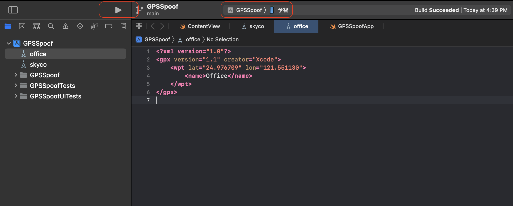
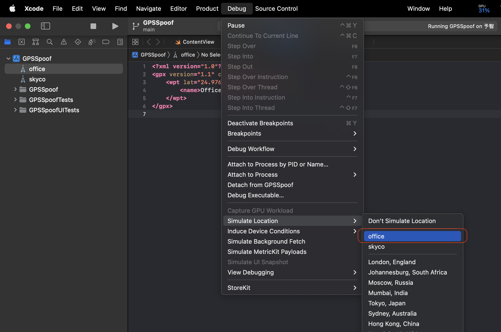
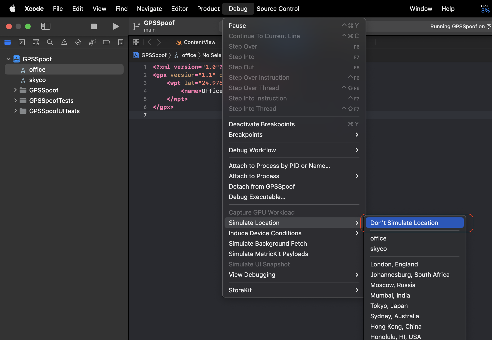

# GPSSpoof

Modify iOS device GPS location by Xcode debugging function, no jailbreak required.

> ⚠️ Connection to the Xcode is required, either by USB or WiFi.

## Get Started

1. Build & Run the app on your device

2. After the app is launched on your iOS device, go to menu `Debug -> Simulate Location` in Xcode, and set the location you want to spoof.

3. Now you can see the location is changed on your device.

4. If you want to stop spoofing, just go to menu `Debug -> Don't Simulate Location` in Xcode.

5. Happy weekday!
